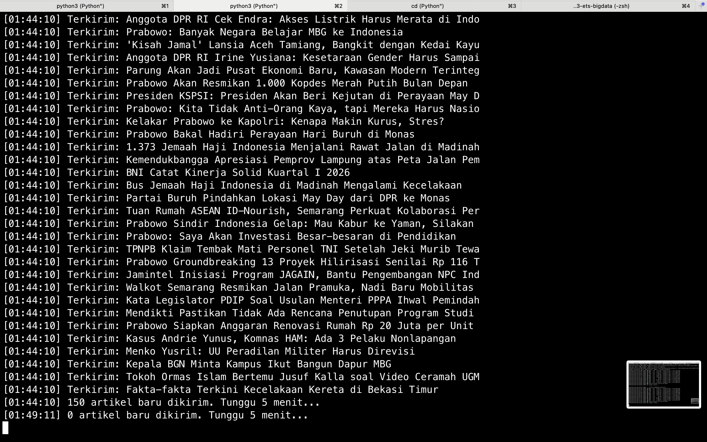
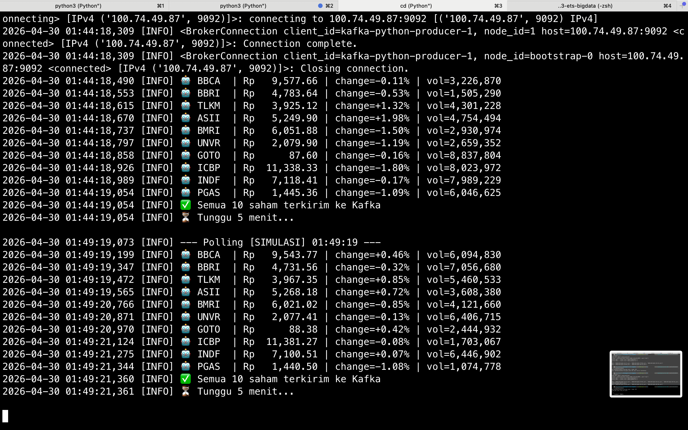
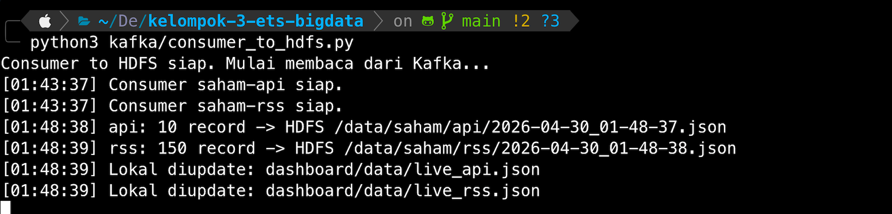

# SahamMeter 📈
Sistem monitoring saham IDX real-time menggunakan Big Data Pipeline.

## Anggota Kelompok
| Bagian | Nama | Kontribusi |
|--------|------|------------|
| A - Infra/Docker | Oryza | Setup Hadoop, Kafka, HDFS, README |
| B - Producer API | Nadia | producer_api.py, yfinance, simulator |
| C - Producer RSS + Consumer | Jose | producer_rss.py, consumer_to_hdfs.py |
| D - Spark Analysis | Binar | spark/analysis.ipynb, 3 analisis |
| E - Dashboard | Gilang | dashboard/app.py, index.html |

## Arsitektur Sistem
[  Topic Kafka  ]
  - saham-api  → data harga saham (BBCA, BBRI, TLKM, ASII, BMRI)
  - saham-rss  → artikel berita pasar modal

[ yfinance API ]                               [ RSS Feed Berita ]
       │                                                │
       ▼                                                ▼
┌──────────────┐                               ┌────────────────┐
│ producer_api │                               │  producer_rss  │
└──────┬───────┘                               └────────┬───────┘
       │                                                │
       ▼                                                ▼
╔═══════════════════════════════════════════════════════════════╗
║                         APACHE KAFKA                          ║
║      (Topic: saham-api)               (Topic: saham-rss)      ║
╚═══════════════════════════════╤═══════════════════════════════╝
                                │
                                ▼
                        ┌───────────────┐
                        │   consumer_   │
                        │    to_hdfs    │
                        └───────┬───────┘
                                │
                                ▼
╔═══════════════════════════════════════════════════════════════╗
║                          HADOOP HDFS                          ║
║      /data/saham/api/                 /data/saham/rss/        ║
╚═══════════════════════════════╤═══════════════════════════════╝
                                │
                                ▼
                        ┌───────────────┐
                        │ Apache Spark  │
                        │ (analysis.py) │
                        └───────┬───────┘
                                │
                                ▼
                        ┌───────────────┐
                        │   Dashboard   │
                        │    (Flask)    │
                        └───────────────┘

##  Struktur Folder
saham-meter/
├── docker-compose-hadoop.yml
├── docker-compose-kafka.yml
├── hadoop.env
├── setup.sh
├── kafka/
│   ├── producer_api.py
│   ├── producer_rss.py
│   └── consumer_to_hdfs.py
├── spark/
│   └── analysis.ipynb
├── dashboard/
│   ├── app.py
│   ├── data/
│   │   ├── live_api.json
│   │   ├── live_rss.json
│   │   └── spark_results.json
│   └── templates/
│       └── index.html
└── README.md

## Cara Menjalankan

### Prasyarat
- Docker & Docker Compose terinstall
- Python 3.8+
- pip install kafka-python yfinance feedparser pyspark flask

### 1. Setup Infrastruktur (jalankan sekali)
```bash
./setup.sh
```
Atau manual:
```bash
# Jalankan Hadoop
docker compose -f docker-compose-hadoop.yml up -d
sleep 30

# Lalu buat direktori HDFS
docker exec namenode hdfs dfs -mkdir -p /data/saham/api
docker exec namenode hdfs dfs -mkdir -p /data/saham/rss
docker exec namenode hdfs dfs -mkdir -p /data/saham/hasil

# Jalankan Kafka
docker compose -f docker-compose-kafka.yml up -d
sleep 20

# Pengecekan docker 
docker ps --format "table {{.Names}}\t{{.Status}}\t{{.Ports}}" 

# Topic kafka
docker exec kafka-broker kafka-topics.sh --create --topic saham-api --bootstrap-server localhost:9092 --partitions 1 --replication-factor 1
docker exec kafka-broker kafka-topics.sh --create --topic saham-rss --bootstrap-server localhost:9092 --partitions 1 --replication-factor 1

# Verifikasi topics
docker exec kafka-broker kafka-topics --list --bootstrap-server localhost:9092
```

### 2. Jalankan Consumer (background)
```bash
python kafka/consumer_to_hdfs.py &
```

### 3. Jalankan Producers
```bash
python kafka/producer_api.py &
python kafka/producer_rss.py &
```

### 4. Verifikasi Data Masuk ke HDFS
```bash
# Tunggu 2-5 menit, lalu:
docker exec namenode hdfs dfs -ls /data/saham/api/
docker exec namenode hdfs dfs -ls /data/saham/rss/
```

### 5. Jalankan Spark Analysis
```bash
jupyter notebook spark/analysis.ipynb
# Jalankan semua cell
```

### 6. Jalankan Dashboard
```bash
python dashboard/app.py
# Buka http://localhost:5000
```

## Screenshot
<!-- Isi setelah demo berjalan -->
- [ ] HDFS Web UI (localhost:9870)


- [ ] Kafka consumer output


- [ ] Dashboard berjalan

## Tantangan & Refleksi
- **Tantangan**: 
- **Solusi**: 

## Urutan Menjalankan Saat Demo
1. Buka Docker Desktop
2. Start Hadoop → Start Kafka → Verifikasi topics
3. Jalankan consumer_to_hdfs.py (background)
4. Jalankan producer_api.py + producer_rss.py
5. Tunggu ~5 menit → cek data masuk HDFS
6. Jalankan Spark analysis.ipynb
7. Jalankan dashboard app.py
8. Buka localhost:5000 → demo!


## Bagian A: Infrastruktur Terdistribusi (Hadoop & Kafka)
Penanggung Jawab: Oryza Qiara Ramadhani

Bagian ini memuat konfigurasi fondasi Big Data untuk proyek SahamMeter. Seluruh environment dikontainerisasi menggunakan Docker untuk memastikan konsistensi antarpengembang dan mensimulasikan lingkungan cloud terdistribusi. Infrastruktur dibagi menjadi dua file Compose yang terpisah (hadoop dan kafka) untuk menerapkan prinsip High Availability dan Decoupled Architecture.

### Arsitektur Container
Infrastruktur ini menjalankan total 6 container yang terhubung dalam satu jaringan internal Docker:
- Storage Layer (Hadoop Cluster):
- namenode (HDFS Master) - Web UI: Port 9870
- datanode (HDFS Worker)
- resourcemanager (YARN Master)
- nodemanager (YARN Worker)
- Ingestion Layer (Kafka Cluster):
- zookeeper (Cluster Manager)
- kafka-broker (Message Broker) - Port 9092

Catatan: Seluruh data di-hosting terpusat dan dapat diakses oleh anggota tim secara remote melalui IP Tailscale 100.74.49.87.

### Struktur Data & Antrean
Sistem ini telah dikonfigurasi dengan jalur data (Single Source of Truth) sebagai berikut:

Kafka Topics:
- saham-api (Untuk data harga saham real-time Yahoo Finance)
- saham-rss (Untuk data teks berita dari portal RSS)

HDFS Directories:
- /data/saham/api/ (Penyimpanan mentah data API)
- /data/saham/rss/ (Penyimpanan mentah data RSS)
- /data/saham/hasil/ (Penyimpanan hasil analitik Apache Spark)

### Cara Menjalankan Infrastruktur
Pastikan Docker Desktop sudah berjalan di sistem (Windows/Mac/Linux). Untuk kemudahan operasional, kami telah menyediakan script otomatisasi menggunakan PowerShell.

Cara Otomatis (Sangat Direkomendasikan):
Buka terminal dan jalankan script berikut untuk mematikan container lama, menyalakan ulang secara sinkron, dan mengecek kesiapan Kafka:

` .\restart.ps1 `

Cara Manual:
Jika ingin menyalakan cluster secara terpisah, gunakan perintah berikut:

```
# Menyalakan Hadoop Cluster
docker compose -f docker-compose-hadoop.yml up -d

# Menyalakan Kafka Cluster
docker compose -f docker-compose-kafka.yml up -d
```

### Cara Verifikasi Sistem
Setelah infrastruktur menyala, lakukan pengecekan berikut untuk memastikan sistem berjalan normal sebelum menjalankan Producer dan Consumer:

1. Mengecek Status Kafka Topic

```
docker exec -it kafka-broker kafka-topics --list --bootstrap-server localhost:9092
```
(Ekspektasi output: Muncul daftar topic saham-api dan saham-rss)

2. Mengecek Status HDFS (Storage)
Buka browser dan akses HDFS Web UI melalui:
` http://100.74.49.87:9870 `
Arahkan ke menu Utilities > Browse the file system dan pastikan direktori /data/saham/ sudah terbentuk dengan baik.

## B - Producer API (Nadia)

### Deskripsi
Producer yang mengambil harga saham real-time dari yfinance dan mengirimkannya ke Kafka topic `saham-api` setiap 5 menit. Dilengkapi simulator otomatis untuk di luar jam bursa (09.00–15.30 WIB).

### File yang Dibuat
- `kafka/producer_api.py`

### Prasyarat
1. Tailscale sudah terinstall dan terhubung ke jaringan kelompok
2. Kafka sudah berjalan di laptop Oryza (Bagian A)
3. Topic `saham-api` sudah dibuat

### Instalasi
pip install kafka-python yfinance

### Konfigurasi
Buka `kafka/producer_api.py`, sesuaikan IP laptop Oryza:
KAFKA_BROKER = "100.74.49.87:9092"

### Cara Menjalankan
python kafka/producer_api.py

### Output yang Diharapkan
✅ Producer siap!

🚀 Producer mulai berjalan...

📈 LIVE: {'ticker': 'BBCA', 'harga': 6025.0, 'volume': 205154435, 'timestamp': '2026-04-27T14:02:27'}

📈 LIVE: {'ticker': 'BBRI', 'harga': 3090.0, 'volume': 254001573, 'timestamp': '2026-04-27T14:02:27'}

📈 LIVE: {'ticker': 'TLKM', 'harga': 2820.0, 'volume': 135196724, 'timestamp': '2026-04-27T14:02:28'}

📈 LIVE: {'ticker': 'ASII', 'harga': 6200.0, 'volume': 48836235,  'timestamp': '2026-04-27T14:02:28'}

📈 LIVE: {'ticker': 'BMRI', 'harga': 4410.0, 'volume': 185660877, 'timestamp': '2026-04-27T14:02:28'}

✅ 14:02:28 - Semua saham terkirim ke Kafka

⏳ Tunggu 5 menit...

### Verifikasi Data Masuk ke Kafka
Jalankan di laptop Oryza:
docker exec -it kafka-broker kafka-console-consumer --topic saham-api --from-beginning --bootstrap-server localhost:9092

### Catatan
- Jam bursa aktif: Senin–Jumat 09.00–15.30 WIB → data LIVE dari yfinance
- Di luar jam bursa → simulator otomatis aktif (harga naik/turun ±1%)
- Field is_simulated: true menandakan data hasil simulator
- Jalankan setelah Bagian A (infrastruktur) sudah aktif


# Producer RSS & Consumer to HDFS (Putri Joselina Silitonga)

Dokumentasi teknis untuk dua komponen pipeline SahamMeter: **Producer RSS** yang mengambil dan mempublikasikan berita pasar modal ke Kafka, serta **Consumer to HDFS** yang mengonsumsi pesan dari Kafka dan menyimpannya ke Hadoop HDFS.

---

## Daftar Isi

- [Producer RSS](#producer-rss)
- [Consumer to HDFS](#consumer-to-hdfs)
- [Bukti Sistem Berjalan](#bukti-sistem-berjalan)

---

## Producer RSS

### Deskripsi

Producer RSS bertugas melakukan polling berita keuangan dan pasar modal dari sumber RSS Indonesia secara periodik. Setiap artikel yang belum pernah dikirim akan dideteksi sentimennya secara otomatis, lalu dipublikasikan ke Kafka topic `saham-rss`. Sistem dirancang idempoten — artikel yang sudah terkirim tidak akan pernah dikirim ulang meskipun masih muncul di feed, bahkan setelah producer di-restart.

---

### Lokasi File

| File | Keterangan |
|------|------------|
| `kafka/producer_rss.py` | Script utama producer RSS |
| `kafka/sent_ids.txt` | Penyimpanan persisten ID artikel yang sudah dikirim |

---

### Dependensi

```bash
pip install kafka-python feedparser
```

---

### Konfigurasi

| Variabel | Nilai Default | Keterangan |
|----------|---------------|------------|
| `KAFKA_BROKER` | `100.74.49.87:9092` | IP broker Kafka via Tailscale |
| `KAFKA_TOPIC` | `saham-rss` | Nama topic Kafka tujuan |
| `INTERVAL` | `300` | Jeda antar polling dalam detik |
| `SENT_IDS_FILE` | `kafka/sent_ids.txt` | File penyimpanan ID artikel |

---

### Sumber RSS

| Media | URL Feed |
|-------|----------|
| CNN Indonesia (Ekonomi) | `https://www.cnnindonesia.com/ekonomi/rss` |
| Kompas Money | `https://rss.kompas.com/feed/kompas.com/money` |
| Tempo Nasional | `https://rss.tempo.co/nasional` |

---

### Cara Menjalankan

Pastikan Kafka broker aktif dan topic `saham-rss` sudah dibuat sebelum menjalankan script ini.

```bash
python kafka/producer_rss.py
```

---

### Alur Kerja

1. Memuat daftar ID artikel yang sudah dikirim dari `sent_ids.txt`
2. Melakukan fetch setiap URL feed menggunakan `feedparser`
3. Memeriksa setiap artikel — jika ID sudah ada di daftar, artikel dilewati
4. Menganalisis sentimen artikel berdasarkan kata kunci di judul
5. Mengemas data dalam format JSON dan mengirim ke Kafka
6. Menyimpan ID artikel baru ke `sent_ids.txt`
7. Menunggu 5 menit, lalu mengulang dari langkah 1

---

### Mekanisme Deduplikasi

Setiap artikel diidentifikasi menggunakan **MD5 hash 8 karakter dari URL-nya**. Hash disimpan secara persisten di `kafka/sent_ids.txt`. Artikel yang hash-nya sudah tercatat akan dilewati tanpa dikirim ulang.

**Contoh isi `kafka/sent_ids.txt`:**

```
a3f1e2c4
b9d2a7f1
c8e3d501
d4f7b293
```

---

### Deteksi Sentimen Otomatis

Sentimen dideteksi berdasarkan kata kunci yang ditemukan dalam judul artikel.

| Label | Kata Kunci Pemicu |
|-------|-------------------|
| `positif` | naik, bullish, untung, rekor, tumbuh, profit, meningkat, optimis |
| `negatif` | turun, bearish, rugi, anjlok, merosot, koreksi, jatuh, pesimis |
| `netral` | tidak ditemukan kata kunci dari kedua kategori di atas |

---

### Struktur Data yang Dikirim ke Kafka

```json
{
  "id": "a3f1e2c4",
  "judul": "BNI Catat Kinerja Solid Kuartal I 2026",
  "url": "https://www.cnnindonesia.com/ekonomi/...",
  "ringkasan": "PT Bank Negara Indonesia mencatat pertumbuhan laba bersih...",
  "sumber": "CNN Indonesia",
  "sentimen": "positif",
  "waktu_terbit": "Thu, 30 Apr 2026 01:30:00 +0700",
  "timestamp": "2026-04-30T01:44:10"
}
```

> Field `ringkasan` dibatasi maksimal **300 karakter** dari konten artikel.

---

### Contoh Output Terminal

```
Producer RSS siap. Mulai polling...
[01:44:10] Terkirim: BNI Catat Kinerja Solid Kuartal I 2026
[01:44:10] Terkirim: Prabowo Groundbreaking 13 Proyek Hilirisasi Senilai Rp 116 T
[01:44:10] Terkirim: Bus Jemaah Haji Indonesia di Madinah Mengalami Kecelakaan
[01:44:10] Terkirim: Fakta-fakta Terkini Kecelakaan Kereta di Bekasi Timur
[01:44:10] 150 artikel baru dikirim. Tunggu 5 menit...
[01:49:11] 0 artikel baru dikirim. Tunggu 5 menit...
```

> Output `0 artikel baru dikirim` pada siklus kedua membuktikan deduplikasi berjalan dengan benar.

---

### Verifikasi Data di Kafka

```bash
docker exec -it kafka-broker kafka-console-consumer.sh \
  --topic saham-rss \
  --from-beginning \
  --bootstrap-server localhost:9092
```

---

---

## Consumer to HDFS

### Deskripsi

Consumer membaca pesan secara paralel dari dua Kafka topic (`saham-api` dan `saham-rss`) menggunakan multi-threading, lalu menyimpan data ke Hadoop HDFS dalam format JSON bertimestamp setiap 5 menit. Data terbaru juga disalin ke file lokal yang digunakan langsung oleh dashboard Flask sebagai cache.

Arsitektur menggunakan **buffer berbasis thread** — dua thread berjalan paralel mengisi buffer masing-masing, sementara main thread menguras buffer secara terjadwal dan mem-flush hasilnya ke HDFS.

---

### Lokasi File

| File | Keterangan |
|------|------------|
| `kafka/consumer_to_hdfs.py` | Script utama consumer |
| `dashboard/data/live_api.json` | Cache lokal 50 data harga saham terbaru |
| `dashboard/data/live_rss.json` | Cache lokal 50 berita terbaru |

---

### Dependensi

```bash
pip install kafka-python hdfs
```

---

### Konfigurasi

| Variabel | Nilai Default | Keterangan |
|----------|---------------|------------|
| `KAFKA_BROKER` | `100.74.49.87:9092` | IP broker Kafka via Tailscale |
| `TOPIC_API` | `saham-api` | Topic Kafka data harga saham |
| `TOPIC_RSS` | `saham-rss` | Topic Kafka data berita |
| `HDFS_URL` | `http://100.74.49.87:9870` | URL NameNode HDFS |
| `HDFS_USER` | `root` | User autentikasi HDFS |
| `HDFS_PATH_API` | `/data/saham/api` | Path HDFS untuk data harga |
| `HDFS_PATH_RSS` | `/data/saham/rss` | Path HDFS untuk data berita |
| `INTERVAL` | `300` | Interval flush ke HDFS dalam detik |

---

### Cara Menjalankan

> **Penting:** Consumer harus dijalankan **sebelum** producers aktif agar tidak ada pesan yang terlewat.

```bash
python kafka/consumer_to_hdfs.py &
```

---

### Arsitektur Internal

| Komponen | Tugas |
|----------|-------|
| Thread 1 | Consume topic `saham-api` secara terus-menerus, isi `buffer_api` |
| Thread 2 | Consume topic `saham-rss` secara terus-menerus, isi `buffer_rss` |
| Main Thread | Setiap 5 menit: ambil snapshot buffer → tulis ke HDFS → update file lokal |

Setiap buffer dilindungi oleh `threading.Lock()` untuk mencegah race condition saat thread consumer dan main thread mengakses buffer secara bersamaan.

---

### Format Penyimpanan di HDFS

File disimpan dengan nama bertimestamp sehingga setiap siklus menghasilkan file baru tanpa menimpa data sebelumnya.

| Path HDFS | Contoh Nama File |
|-----------|------------------|
| `/data/saham/api/` | `2026-04-30_01-21-57.json` |
| `/data/saham/api/` | `2026-04-30_01-27-05.json` |
| `/data/saham/rss/` | `2026-04-30_01-22-04.json` |
| `/data/saham/rss/` | `2026-04-30_01-34-43.json` |

Setiap file berisi array JSON dari semua pesan yang masuk selama interval 5 menit terakhir.

---

### Output Lokal untuk Dashboard

| File | Isi | Digunakan Oleh |
|------|-----|----------------|
| `dashboard/data/live_api.json` | 50 data harga saham terbaru | `dashboard/app.py` |
| `dashboard/data/live_rss.json` | 50 berita terbaru | `dashboard/app.py` |

File ini memungkinkan Flask membaca data terbaru tanpa perlu query langsung ke HDFS setiap request.

---

### Contoh Output Terminal

```
Consumer to HDFS siap. Mulai membaca dari Kafka...
[01:21:55] Consumer saham-api siap.
[01:21:55] Consumer saham-rss siap.
[01:26:57] api: 10 record -> HDFS /data/saham/api/2026-04-30_01-21-57.json
[01:26:57] rss: 150 record -> HDFS /data/saham/rss/2026-04-30_01-22-04.json
[01:26:57] Lokal diupdate: dashboard/data/live_api.json
[01:26:57] Lokal diupdate: dashboard/data/live_rss.json
[01:31:57] api: 10 record -> HDFS /data/saham/api/2026-04-30_01-27-05.json
[01:31:57] rss: 0 record, skip.
```

---

### Verifikasi Data di HDFS

```bash
# Cek daftar file yang tersimpan
docker exec namenode hdfs dfs -ls /data/saham/api/
docker exec namenode hdfs dfs -ls /data/saham/rss/

# Baca isi file terbaru
docker exec namenode hdfs dfs -cat /data/saham/api/2026-04-30_01-48-37.json | head -30
```

---

### Catatan Teknis

- Consumer menggunakan `auto_offset_reset="earliest"` — jika di-restart, semua pesan lama dibaca ulang dari awal. Berguna untuk recovery, namun dapat menghasilkan duplikasi record di HDFS.
- `consumer_timeout_ms=1000` memastikan consumer tidak blocking saat tidak ada pesan baru masuk.
- Jika koneksi HDFS gagal pada satu siklus, error dicatat ke stdout tetapi consumer tetap berjalan dan mencoba kembali pada siklus berikutnya.
- Direktori `dashboard/data/` dibuat otomatis oleh script jika belum ada.

---

---

## Bukti Sistem Berjalan

### Producer RSS — Artikel Terkirim ke Kafka



> Screenshot menunjukkan producer berhasil mengirim 150 artikel pada polling pertama pukul 01:44:10. Polling berikutnya pukul 01:49:11 menghasilkan 0 artikel baru, membuktikan mekanisme deduplikasi berjalan sempurna.

---

### Producer API — Data Saham Terkirim ke Kafka



> Screenshot menunjukkan 10 saham blue-chip IDX berhasil dikirim ke Kafka topic `saham-api` dalam mode SIMULASI. Data mencakup harga, persentase perubahan, dan volume transaksi untuk setiap emiten.

---

### Consumer — Data Berhasil Masuk ke HDFS


