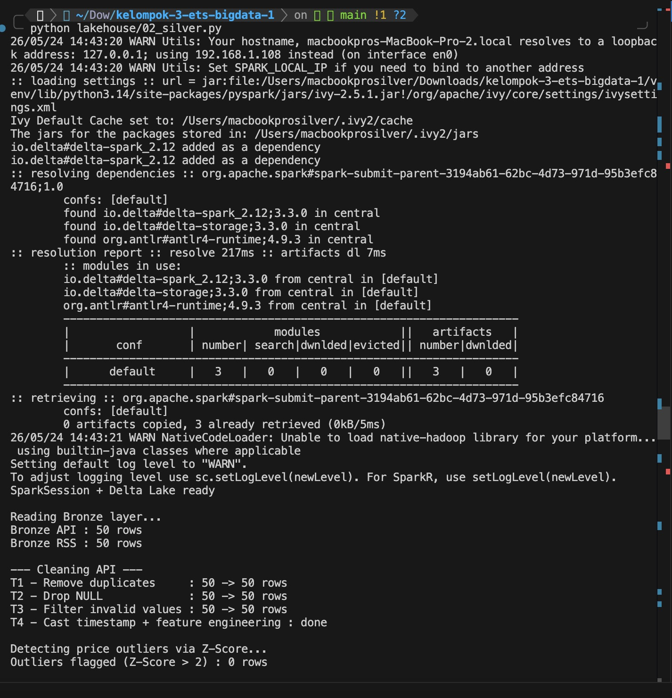
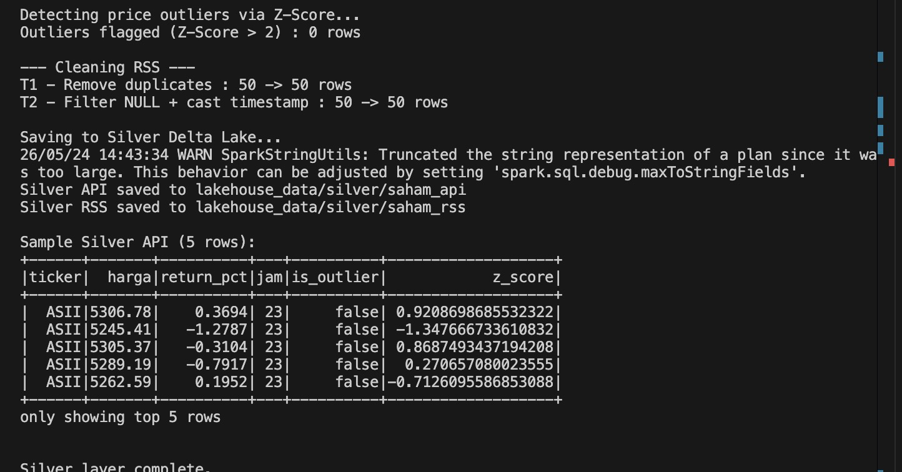
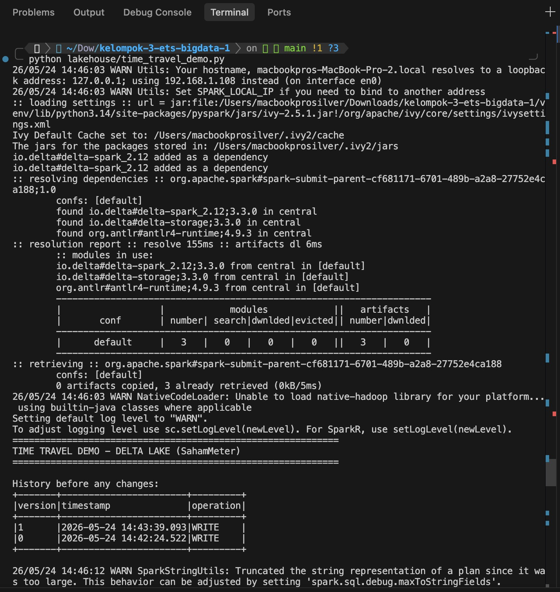
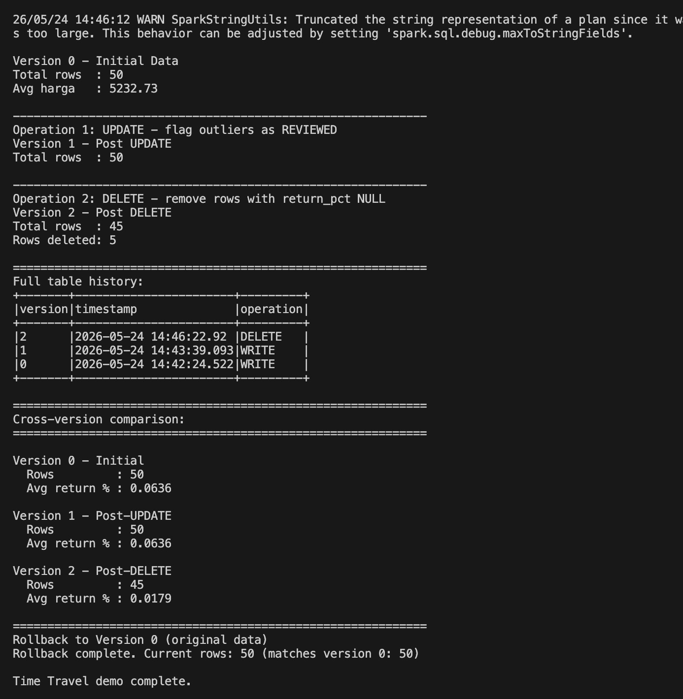
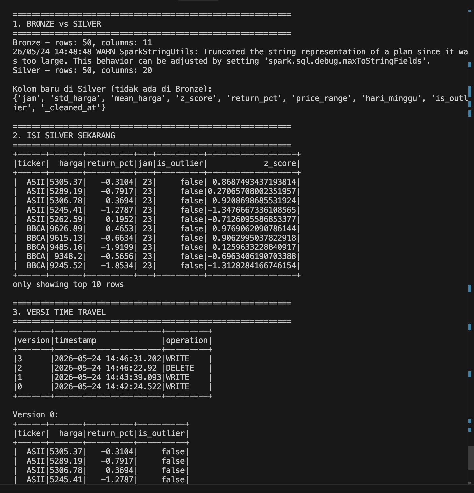
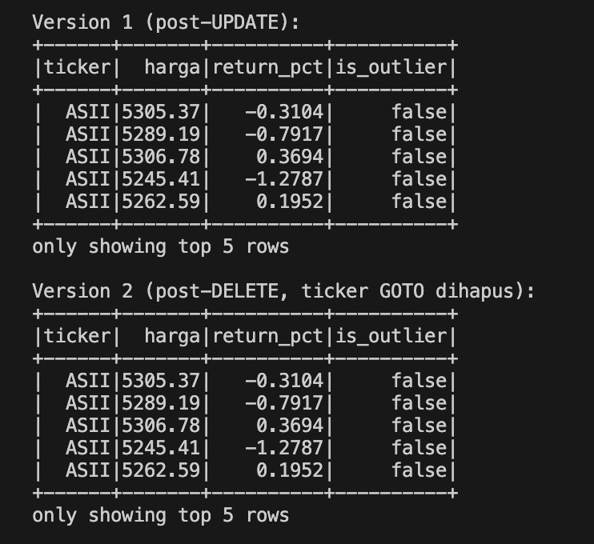

# 2. Silver Layer & Time Travel 

## Tugas yang Dikerjakan

- `02_silver.py` — Cleaning data dari Bronze ke Silver (Delta Lake)
- `time_travel_demo.py` — Demonstrasi Time Travel Delta Lake

---

## Arsitektur Silver Layer

```
Bronze (Parquet)
    ├── lakehouse_data/bronze/saham_api   ← data mentah API
    └── lakehouse_data/bronze/saham_rss   ← data mentah RSS
                        ↓
                  02_silver.py
                        ↓
Silver (Delta Lake)
    ├── lakehouse_data/silver/saham_api   ← data bersih + Z-Score
    └── lakehouse_data/silver/saham_rss   ← data bersih + cast timestamp
```

---

## Transformasi Cleaning — 02_silver.py

### API Data

| No | Transformasi | Sebelum | Sesudah | Alasan |
|----|-------------|---------|---------|--------|
| T1 | Hapus duplikat (`ticker` + `timestamp`) | 50 baris | 50 baris | Record ganda dari producer akan merusak kalkulasi return dan volume |
| T2 | Hapus baris NULL (`ticker`, `harga`) | 50 baris | 50 baris | Harga NULL tidak bisa dipakai untuk menghitung return_pct maupun analisis volatilitas |
| T3 | Filter nilai tidak logis (`harga <= 0`, `high < low`) | 50 baris | 50 baris | Harga negatif atau high < low adalah data korup dari sumber API |
| T4 | Cast timestamp + feature engineering | 50 baris | 50 baris | Timestamp harus bertipe TimestampType agar Window Function bisa dipakai di Gold layer |

### Kolom Baru di Silver (tidak ada di Bronze)

| Kolom | Keterangan |
|-------|-----------|
| `return_pct` | Persentase return: `(harga - open) / open * 100` |
| `price_range` | Selisih high - low sebagai indikator volatilitas harian |
| `jam` | Jam dari timestamp, untuk analisis temporal di Gold |
| `hari_minggu` | Hari dalam seminggu (1=Minggu, 7=Sabtu) |
| `mean_harga` | Rata-rata harga per ticker (window function) |
| `std_harga` | Standar deviasi harga per ticker |
| `z_score` | Z-Score harga relatif terhadap rata-rata ticker |
| `is_outlier` | Flag `true` jika Z-Score > 2 (harga anomali) |
| `_cleaned_at` | Timestamp saat proses cleaning dijalankan |

Bronze memiliki 11 kolom. Setelah cleaning, Silver memiliki 20 kolom.

> Outlier tidak dihapus di Silver. Data tetap dipertahankan agar Gold layer bisa menganalisis kejadian anomali harga secara terpisah.

### RSS Data

| No | Transformasi | Sebelum | Sesudah | Alasan |
|----|-------------|---------|---------|--------|
| T1 | Hapus duplikat (`id`) | 50 baris | 50 baris | Artikel yang sama kadang dipublikasikan ulang dengan ID identik |
| T2 | Filter NULL + cast `waktu_terbit` | 50 baris | 50 baris | Artikel tanpa judul tidak bisa dipakai untuk analisis korelasi berita-harga di Gold |

---

## Mengapa Delta Lake Lebih Baik dari Parquet/JSON Biasa?

| Fitur | JSON/Parquet (ETS lama) | Delta Lake (Tugas ini) |
|-------|------------------------|----------------------|
| ACID Transaction | Tidak ada | Ada |
| Schema enforcement | Tidak ada | Ada |
| History perubahan | Tidak ada | Ada (Time Travel) |
| Rollback data | Tidak bisa | Bisa ke versi manapun |
| Update / Delete | Tidak bisa | Bisa |
| Audit trail | Tidak ada | Ada (operation log) |

---

## Time Travel  — time_travel_demo.py

### Alur Operasi

```
Version 0 (WRITE)   → Data Silver awal hasil cleaning, 50 baris
        ↓
Version 1 (UPDATE)  → Z-score outlier diubah menjadi -99.0
        ↓
Version 2 (DELETE)  → Semua baris ticker GOTO dihapus (5 baris)
        ↓
Rollback            → Data dikembalikan ke Version 0 (50 baris)
```

### Hasil Perbandingan Lintas Versi

| Versi | Operasi | Jumlah Baris | Avg Return % |
|-------|---------|-------------|-------------|
| 0 | Initial (post-cleaning) | 50 | 0.0636 |
| 1 | Post-UPDATE | 50 | 0.0636 |
| 2 | Post-DELETE (GOTO dihapus) | 45 | 0.0179 |
| Rollback | Kembali ke Version 0 | 50 | 0.0636 |

Menghapus 5 baris ticker GOTO mengubah rata-rata return dari 0.0636 menjadi 0.0179. Ini membuktikan bahwa Time Travel tidak hanya menyimpan data, tetapi juga memungkinkan audit dampak perubahan data terhadap analisis — sesuatu yang tidak mungkin dilakukan dengan JSON atau Parquet biasa.

---

## Cara Menjalankan

```bash
# Aktifkan virtual environment
source venv/bin/activate

# Jalankan Silver layer
python lakehouse/02_silver.py

# Jalankan Time Travel demo
python lakehouse/time_travel_demo.py

# Cek perbandingan Bronze vs Silver dan semua versi
python lakehouse/cek_data.py
```

---

## Screenshot Output

### 02_silver.py



### time_travel_demo.py



## Hasil

